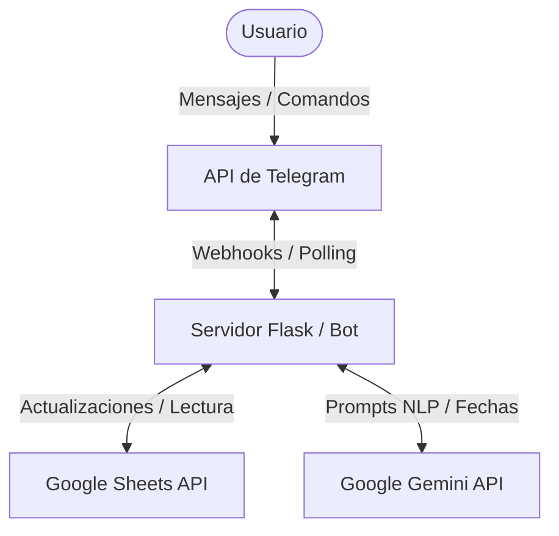

# 🤖 GAMMA — Bot de Gestión Avanzada (Marcaciones, Reportes e IA)

**GAMMA** es un ecosistema automatizado en forma de bot de Telegram diseñado para optimizar el registro de horas laborales, la gestión financiera y el agendamiento inteligente de recordatorios. Construido sobre la API de Telegram y completamente integrado con **Google Sheets** y **Gemini 2.5**, está optimizado para funcionar las 24 horas del día en entornos de servidor como **PythonAnywhere**.

---

## 🚀 Características Principales

*   **⏱️ Sistema Inteligente de Marcado:** Control de asistencia dinámico en Google Sheets mediante comandos interactivos. Soporta jornadas normales con pausas de almuerzo o salidas directas.
*   **💰 Gestión Financiera y Deudas (Nuevo v1.10.0):** Sistema contable integrado. Incluye comandos para alta de deudas (`/nueva_deuda`), registro de abonos (`/abonar`), simulación de proyectos (`/simular`), y cierres mensuales automatizados (`/cierre_mensual`).
*   **🧠 Agendamiento con Lenguaje Natural:** Interpretación semántica de mensajes libres (ej: *"hacer el laboratorio mañana a la tarde"*) utilizando el modelo `gemini-2.5-flash` para extraer hitos con precisión cronológica.
*   **📋 Panel Visual de Avisos:** Interfaz móvil interactiva con cuadrículas de botones en tiempo real para visualizar, limpiar de forma automática y eliminar recordatorios en caliente sin generar spam en el chat.
*   **🔔 Control de Alertas Anti-Spam:** Sistema de notificaciones programadas por hitos temporales que avisa de manera automática a los 30, 7, 5, 3 y 1 días de anticipación de cada evento.
*   **📊 Generación de Reportes Financieros en PDF:** Al cerrar un ciclo, calcula automáticamente las horas acumuladas basándose en fórmulas dinámicas de Sheets, aplica descuentos personalizados si se solicita y genera un reporte contable PDF estilizado con ReportLab.

---

## 🛠️ Stack Tecnológico

*   **Lenguaje:** Python 3.x
*   **Framework de Bot:** `pyTelegramBotAPI` (TeleBot)
*   **Integración Cloud:** `gspread` & `google-oauth2` (Google Sheets API)
*   **Motor de IA:** `google-genai` (Gemini 2.5 API)
*   **Diseño de Documentos:** `reportlab` (Generación de PDF)
*   **Manejo del Tiempo:** `pytz` (Anclado estricto a la zona horaria de Paraguay/Bs.As.)

---

## 📂 Estructura del Proyecto

```text
Gamma_bot/
├── com/                    # Manejadores de comandos de Telegram (ej. deudas.py)
├── logic/                  # Lógica de negocio core (Financiero, Asistencia, Cron jobs)
├── repositories/           # Capa de acceso a datos (Abstracción de Google Sheets)
├── services/               # Integraciones con servicios externos (Telegram API, Calendar, Drive)
├── tests/                  # Suite de pruebas unitarias y de integración (pytest)
├── docs/                   # Documentación de arquitectura, QA y release notes
├── reportes/               # Repositorio local de PDFs contables generados
├── flask_app.py            # Servidor Webhook / Entrypoint del Bot
├── config.py               # Configuraciones globales
├── credentials.json        # Claves de acceso de Google Cloud Service Account
└── .env                    # Variables de entorno confidenciales
```

---

## 🏗️ Arquitectura del Sistema



---

## 🔑 Configuración de Credenciales de Google API

Para que Gamma interactúe con Google Sheets y Drive, es necesario configurar el acceso:

### 1. OAuth (`credentials.json` y `token.json`)

1. Ve a la [Consola de Google Cloud](https://console.cloud.google.com/).
2. Crea un nuevo proyecto y habilita las **Google Sheets API** y **Google Drive API**.
3. Ve a **APIs y Servicios > Credenciales** y crea un **ID de cliente de OAuth** (App de escritorio).
4. Descarga el archivo JSON generado, renómbralo a `credentials.json` y ubícalo en la raíz del proyecto.
5. Al correr el bot por primera vez, se abrirá el navegador pidiendo permisos. Al aceptar, se generará un archivo `token.json`.
6. Conserva ambos archivos, especialmente para entornos cloud.

### 2. Variables de Entorno (`.env`)

Crea un archivo `.env` en la raíz del proyecto para alojar las credenciales y el token de bot:

```env
TELEGRAM_BOT_TOKEN=tu_token_aqui
GEMINI_API_KEY=tu_api_key_de_gemini
```

---

## 🧪 Pruebas Locales

Para desarrollar o ejecutar pruebas de la aplicación en tu entorno local:

1. Clona el repositorio.
2. Instala las dependencias requeridas ejecutando:
   ```bash
   pip install -r requirements.txt
   ```
3. Asegúrate de tener `.env`, `credentials.json` y `token.json` ubicados correctamente.
4. Ejecuta el script principal:
   ```bash
   python mysite/com/bot.py
   ```
5. Ve a Telegram e interactúa con el bot para verificar que todo funcione.

---

## 🚀 Despliegue en PythonAnywhere

1. Transfiere tus archivos al servidor (incluyendo el `.env`, `credentials.json` y `token.json`).
2. Abre una consola bash e instala las dependencias (usando `--user` si es necesario):
   ```bash
   pip install --user -r requirements.txt
   ```
3. Para la modalidad de polling, configura una "Always-on task" (si posees cuenta de pago) o un script que garantice su ejecución en loop:
   ```bash
   python /home/tu_usuario/mysite/com/bot.py
   ```
4. Si prefieres Webhooks, configura la "Web App" de PythonAnywhere con Flask para recibir las peticiones entrantes desde Telegram.
