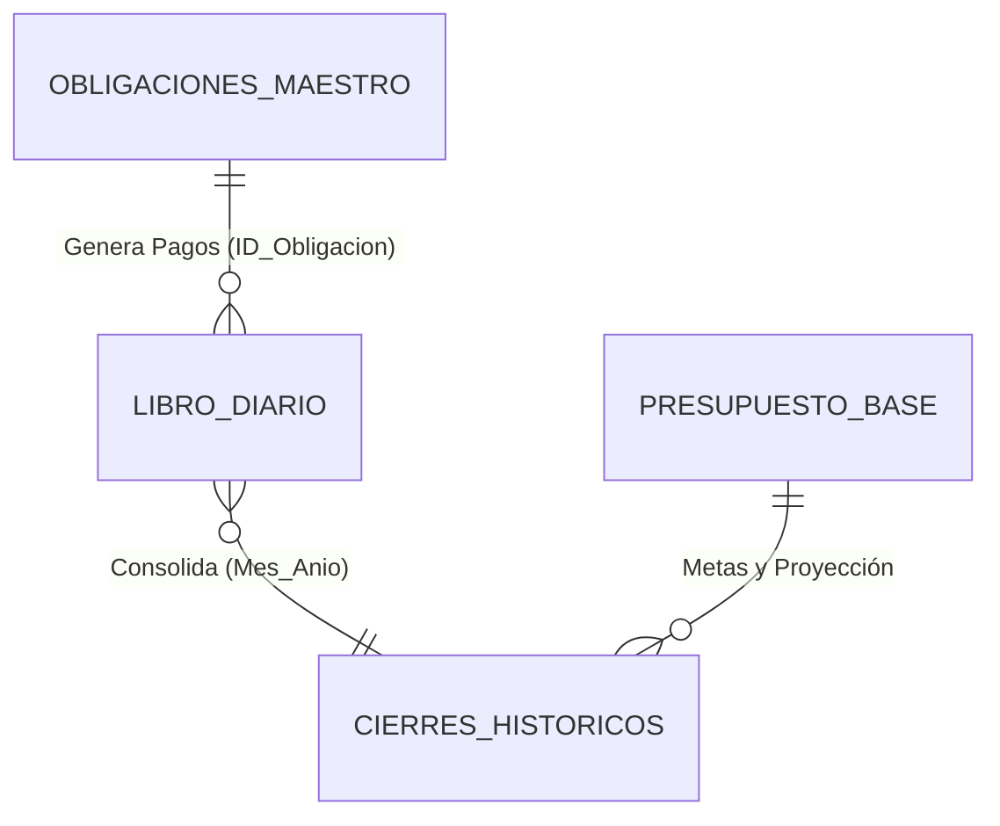

# Modelo Contable y Arquitectura Relacional (Google Sheets)

Este documento define la estructura optimizada de datos para el ecosistema financiero del Bot Gamma (proyectado para la v1.11.0), unificando las directrices del **Software Architect** y el **Financial Accountant**.

## 1. Topología de la Base de Datos (Sheets)

El sistema reduce la fragmentación pasando a un modelo de 4 pestañas centrales relacionadas entre sí.



---

## 2. Pestañas y Esquemas de Datos

### A. `Obligaciones_Maestro`
Concentra todas las responsabilidades financieras a largo plazo (Deudas Activas y Proyectos Simulados).
* **ID_Obligacion:** (Autogenerado)
* **Tipo:** Deuda / Proyecto / Meta de Ahorro
* **Nombre/Concepto:** Descripción
* **Monto_Inicial:** Capital total
* **Saldo_Actual:** Calculado dinámicamente restando los pagos del Libro Diario.
* **Estado:** Simulado / Activo / Pagado / Cancelado
* **Tasa_Interes:** % de interés (opcional)
* **Fecha_Vencimiento:** Día del mes de corte

### B. `Libro_Diario` (Transaccional)
El registro único y continuo de cualquier movimiento de dinero (ingreso, gasto o pago de cuotas). Integrado con cálculo automático tributario.

| Columna | Tipo | Descripción / Fórmula |
| :--- | :--- | :--- |
| `ID_Transaccion` | Texto | Hash único |
| `Fecha` | Fecha | Fecha exacta del movimiento |
| `Concepto` | Texto | Proveedor, cliente o motivo |
| `Tipo_Movimiento` | Lista | `Ingreso` / `Egreso` |
| `Monto_Total` | Moneda | Dinero bruto transferido/pagado |
| `Tasa_IVA` | Lista | `10%`, `5%`, `Exento` |
| `Monto_Gravado` | Fórmula | `=IF(Tasa="10%", Total/1.1, IF(Tasa="5%", Total/1.05, Total))` |
| `Monto_IVA` | Fórmula | `=Monto_Total - Monto_Gravado` |
| `Clasificacion_IVA` | Fórmula | `=IF(Tasa="Exento", "N/A", IF(Tipo="Ingreso", "Débito Fiscal", "Crédito Fiscal"))` |
| `ID_Obligacion` | FK | Vincula el pago a la pestaña Maestro (si aplica) |

### C. `Cierres_Historicos` (Resumen Mensual)
Hoja de consolidación (Anti-Bloat). Solo agrega 1 fila por mes calendario.

| Columna | Fórmula / Lógica |
| :--- | :--- |
| `Mes_Anio` | Ej: `09-2026` |
| `Total_Ingresos_Efectivo` | Sumatoria de Ingresos Brutos del mes |
| `Total_Egresos_Efectivo` | Sumatoria de Gastos (Operativos + Cuotas) del mes |
| `IVA_Debito_Fiscal` | Sumatoria de IVA retenido en ventas/ingresos |
| `IVA_Credito_Fiscal` | Sumatoria de IVA pagado en compras/gastos |
| `Liquidacion_IVA` | `= Debito_Fiscal - Credito_Fiscal` |
| `Estado_IVA` | `=IF(Liquidacion > 0, "A Pagar", "Saldo a Favor")` |
| `Margen_Libre_Disponible` | (Ver fórmula en la siguiente sección) |

### D. `Presupuesto_Base`
Configuración estática o evolutiva de metas mensuales para comparación.
* **Mes_Anio / Categoria / Presupuesto_Asignado**

---

## 3. Lógica Contable Crítica

### Liquidación de Impuestos
El IVA no es dinero propio. Al registrar un "Ingreso" con IVA 10%, el bot separará automáticamente el 10% como **Débito Fiscal** (Pasivo). Al registrar un "Egreso" con factura, lo tomará como **Crédito Fiscal** (Activo). A fin de mes, el `/cierre_mensual` calculará si debes pagarle a la subsecretaría de tributación o si tienes saldo a favor.

### Margen Libre Disponible (Fórmula)
Esta métrica calcula cuánto dinero real queda para gastar en ocio o inversiones, asumiendo un riesgo cero:

```text
  Total de Ingresos en Efectivo
- Total de Egresos Operativos
- Total de Cuotas de Deudas Pagadas
- Provisión de Impuestos (Solo si la Liquidación de IVA > 0)
========================================
= Margen Libre Real Disponible
```
